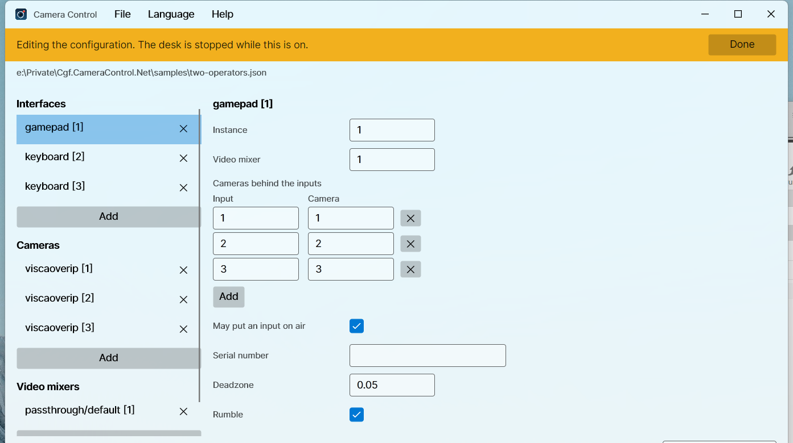
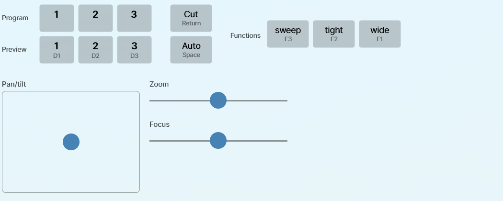

# Camera Control

Drive Blackmagic ATEM switchers and PTZ cameras from a game controller.

One operator steers whichever camera is on preview, changes the preview selection, cuts, toggles
keyers and runs macros, without taking their eyes off the stage.

<br clear="left" />


This is a .NET port of [Cgf.CameraControl.Main](https://github.com/sensslen/Cgf.CameraControl.Main),
which is TypeScript and headless. It reads the same configuration files.

## What it does

- **Steers the preview camera.** The left stick pans and tilts, the right stick zooms and focuses.
  Change preview and the previous camera is stopped rather than left drifting.
- **Runs the switcher.** Cut, auto, keyer toggles, macros, and a macro toggle that picks one of two
  macros from the live state of a keyer or an auxiliary output.
- **Lights the tally.** Cameras that carry a tally light follow the preview and program buses.
- **Shows what is happening.** Select an interface and the window draws it: a pad as a wireframe
  whose buttons light as they are pressed, labelled with what each one does right now. Mixers and
  cameras sit underneath with one lamp each, and a log you can filter by component.
- **Runs without a controller.** A keyboard interface is a small mixer panel: a program and a preview
  row of the inputs, cut and auto, every configured function, a mouse pad for pan and tilt and two
  sliders for zoom and focus. Every key is configurable.
- **Rumbles** on a transition, when one of your cameras goes on air, and when a connection drops.

## Install

| Platform | |
| --- | --- |
| Windows | `winget install Sensslen.CameraControl`, or the installer from [Releases](../../releases) |
| macOS | the `.dmg` from [Releases](../../releases), then drag to Applications |
| Linux | `flatpak install ./CameraControl-<version>-linux-x64.flatpak` |

Every binary is NativeAOT compiled, so there is no .NET runtime to install.

Releases are signed where the project has certificates for it. Without them a Windows installer shows
a SmartScreen warning, and a macOS build is ad-hoc signed rather than notarized, so macOS asks before
opening it: **System Settings → Privacy & Security → Open Anyway**, or clear the download flag once
with `xattr -dr com.apple.quarantine "/Applications/Camera Control.app"`. Every release that went out
that way says so in its notes.

## Configure

Point the application at a `config.json` with **File → Import**, and it reopens the same file next
time. There is a working example in [samples/offline.json](samples/offline.json) that needs no
hardware: it uses a passthrough mixer, so a controller and the interface bindings can be checked on
a laptop.

```json
{
  "cams": [
    { "type": "Websocket.PtzLanc", "instance": 1, "ip": "10.0.0.11", "showTallyLight": false }
  ],
  "videoMixers": [
    { "type": "blackmagicdesign/atem", "instance": 1, "ip": "10.0.0.240", "mixEffectBlock": 0 }
  ],
  "interfaces": [
    {
      "type": "gamepad",
      "instance": 1,
      "videoMixer": 1,
      "connectionChange": { "type": "direct", "default": { "up": 1, "right": 2, "down": 3, "left": 4 } },
      "functions": { "wide": { "type": "key", "index": 1 } },
      "pad": { "default": { "down": "wide" } },
      "cameraMap": { "1": 1 }
    }
  ]
}
```

A problem with one entry is reported against that entry and the rest still load, so a typo in one
camera does not take the desk down with it.

Every key of every entry is described in [docs/Configuration](docs/Configuration/README.md).
[samples/two-operators.json](samples/two-operators.json) puts a pad and two keyboards on one mixer.

### Editing the configuration

**File → Edit configuration** turns the window into an editor for the file it has open. Starting the
application with no configuration turns it on by itself, because a window with nothing in it but a
menu is not an answer to having nothing configured.



Nothing is connected while the mode is on. The cameras and the mixers are torn down, so a pad left in
a pocket cannot move a camera while its bindings are being changed, and a half-written address cannot
be dialled.

The left column becomes the whole file: interfaces, cameras and video mixers, each with an add at the
foot of it. Add asks for the type first and then the fields that type carries, and a cancelled add
leaves nothing behind. Deleting says what still names the entry: a camera goes out of the maps that
named it, and a video mixer leaves the interfaces that drove it to be pointed somewhere else.

**Done** asks whether to save. Saving rewrites the whole file, the entries that were edited from the
form and everything else from the JSON it was read as, and then loads what it wrote, so what the desk
runs is what is on the disk. Comments in the file do not survive, because the loader has always
skipped them. Discarding reloads the file as it is.

A save is refused, with the reasons listed above the panel, while the file names something it does
not define: two entries claiming one instance, a required field left empty, a `cameraMap` naming a
camera that is not configured, an interface naming a mixer that is not configured, or a binding
naming a function the interface has not got. A direction selecting a mixer input with no camera
behind it is not one of those, because that is an ordinary desk.

The functions and the bindings themselves are not edited here yet: an interface's entry keeps them
exactly as they were written. Clicking a control on the drawing to bind it is the next piece of work.

### Cameras

| `type` | Talks to | Needs |
| --- | --- | --- |
| `Websocket.PtzLanc` | the websocket LANC controller firmware | `ip` |
| `Signalr.PtzLanc` | the SignalR LANC controller service | `connectionUrl`, `connectionPort` |
| `viscaoverip` | a VISCA camera over UDP | `ip`, and `port` if it is not 52381 |

All three take `panTiltInvert`. A VISCA camera also takes `tallyMode`, naming the vendor whose tally
payload it understands: `avonic`, `ptzoptics`, or `none`, which is the default. `avonic` carries a
red and a green lamp, and CineTreak cameras answer to it too; `ptzoptics` has one lamp, so preview
leaves it dark.
Nothing in the VISCA specification covers a tally lamp, so a camera sent the wrong vendor's payload
does something unrelated rather than nothing.

[Camera compatibility](docs/CameraCompatibility.md) lists the cameras this has actually been run
against and what a VISCA camera has to accept to work at all.

### Controller bindings

| Control | Does |
| --- | --- |
| Left stick | pan and tilt |
| Right stick | zoom and focus |
| D-pad | change the preview selection |
| A / B / X / Y | the function `pad` binds to down / right / left / up |
| Right shoulder | cut |
| Right trigger | auto |
| Left shoulder | hold for the `alt` bindings |
| Left trigger | hold for the `altLower` bindings |

SDL normalises every controller to this one layout, so `gamepad` is the only interface type that
matters. The old `logitech/F310`, `logitech/F710` and `logitech/Rumblepad2` strings still load, but
they are labels now rather than behaviour.

### The keyboard panel



An interface of type `keyboard` is driven from the window. It is laid out like a mixer: the inputs
twice, once to put on program and once on preview, cut and auto between the rows, and every function
from `functions` to the right. Each button names the key that also fires it and lights while that
key is held. Below them the mouse takes the sticks' place: a pad for pan and tilt, and a slider each
for zoom and focus. Drag and let go, and each springs back to the middle and stops the camera.

Nothing about the keys is fixed. Pan, tilt, zoom, focus, the selection steps, the inputs, the
functions, cut and auto are each bound in `keys`, and only what is bound appears on the panel.
[docs/Configuration/Interfaces.md](docs/Configuration/Interfaces.md) has every key name.

A desk that wants a pad and a keyboard on the same mixer configures one interface of each kind
against the same `videoMixer`.

Two controllers on one machine are told apart by `serialNumber`. That is an absolute filter, never a
preference: an interface whose serial is not present stays unbound and says so, because putting an
operator on somebody else's mixer is worse than binding nothing.

### Languages

English plus ten more, picked from the operating system on first run and changeable under
**Language**. English is the source text; every translation is machine made and none has been
reviewed by a native speaker.

## Build

Needs the .NET 10 SDK. Nothing else.

```bash
dotnet build
dotnet format --verify-no-changes
```

The test projects are Microsoft.Testing.Platform executables, so run them directly rather than
through `dotnet test`:

```bash
for suite in tests/*/bin/Debug/net10.0/*.Tests; do "$suite"; done
```

### Layout

| Project | |
| --- | --- |
| `Cgf.CameraControl.Core` | the domain: factories, configuration, the mixer and camera contracts |
| `Cgf.CameraControl.Atem` | ATEM support over AtemSharp |
| `Cgf.CameraControl.Cameras.WebsocketPtzLanc` | the websocket PTZ LANC camera |
| `Cgf.CameraControl.Cameras.SignalrPtzLanc` | the SignalR PTZ LANC camera |
| `Cgf.CameraControl.Cameras.ViscaOverIp` | the VISCA over IP camera |
| `Cgf.CameraControl.Input.Sdl` | the controller logic and the SDL device layer |
| `Cgf.CameraControl.Licenses.Generator` | compiles the licence report into the app |
| `Cgf.CameraControl.App` | the Avalonia window and the composition root |

Only the app references Avalonia and only `Input.Sdl` references SDL, so everything else is testable
without a display or a controller.

### The `--aot-probe` switch

Two things in this application fail under trimming *without failing the build*: AtemSharp finds its
command types by reflecting over its own assembly, and the translations are embedded resources
because NativeAOT does not load satellite assemblies. Either one can leave a binary that starts,
connects, and quietly does the wrong thing.

`CgfCameraControl --aot-probe` decodes a real ATEM command, serializes a SignalR camera update
through the real hub protocol, and resolves every language, then exits non-zero if any of them has
stopped working. The release workflow runs it against every published binary before anything is
uploaded.

### Third-party licences

**Help → Third-party licences** lists every package the application ships. Opening a row shows what
it is under and the full text of that licence: what the package published for itself where it
published anything, and the text of the SPDX identifier it declared otherwise. Both are compiled into
the binary by `Cgf.CameraControl.Licenses.Generator`, so showing them costs nothing at run time and
they cannot drift from what is actually shipped. The artwork the window draws is listed the same way,
from a hand-written report beside the package one. A licence with no text fails the build rather than
leaving an empty page.

The licence texts are committed. The package report is not: it names the exact versions restored, so
every build generates it first, and a build without one fails rather than crediting nobody. Write it,
and refresh the texts after changing a package reference:

```bash
dotnet tool restore
python packaging/licenses/fetch-texts.py
```

`--report-only` writes just the report, which is what the workflows run, leaving the committed texts
alone. Which licences the project accepts is the check that guards a dependency bump: nuget-license
refuses one that is not on the list, so a new package under something unexpected fails CI. The script
also ignores what builds the binary rather than travelling in it: the diagnostics support package
ships in Debug alone, and the NativeAOT compiler and the trimmer carry the host's runtime identifier
in their package id, so a report naming them would differ between a developer machine and CI.

### The icon

Generated, not drawn by hand, so the SVG and every raster come from the same numbers:

```bash
python packaging/icon/generate.py
```

## Licence

MIT. See [LICENSE](LICENSE).
