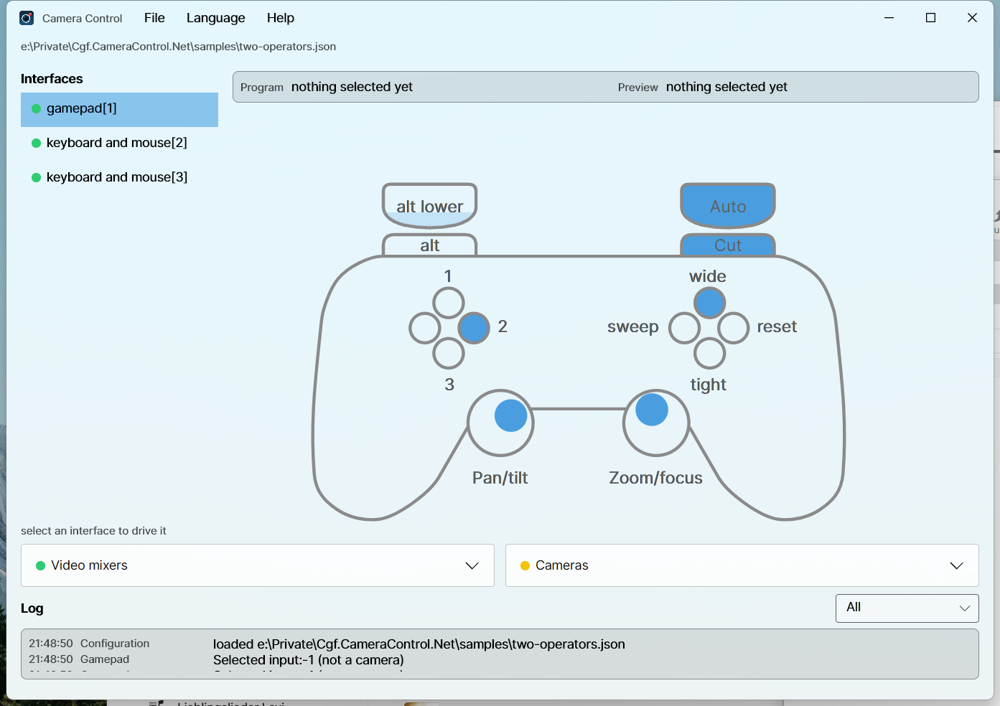

# Camera Control

Drive Blackmagic ATEM switchers and PTZ cameras from a game controller.

One operator steers whichever camera is on preview, changes the preview selection, cuts, toggles
keyers and runs macros, without taking their eyes off the stage.

<br clear="left" />



This is a .NET port of [Cgf.CameraControl.Main](https://github.com/sensslen/Cgf.CameraControl.Main),
which is TypeScript and headless. It reads the same configuration files.

## What it does

- **Steers the preview camera.** The left stick pans and tilts, the right stick zooms and focuses.
  Change preview and the previous camera is stopped rather than left drifting.
- **Runs the switcher.** Cut, auto, keyer toggles, macros, and a macro toggle that picks one of two
  macros from the live state of a keyer or an auxiliary output.
- **Lights the tally.** Cameras that carry a tally light follow the preview and program buses.
- **Shows what is happening.** Every mixer, camera and interface with its live state, and a log you
  can filter by component.
- **Rumbles** on a transition, when one of your cameras goes on air, and when a connection drops.

## Install

| Platform | |
| --- | --- |
| Windows | `winget install Sensslen.CameraControl`, or the installer from [Releases](../../releases) |
| macOS | the `.dmg` from [Releases](../../releases), then drag to Applications |
| Linux | `flatpak install ./CameraControl-<version>-linux-x64.flatpak` |

Every binary is NativeAOT compiled, so there is no .NET runtime to install.

Releases are signed where the project has certificates for it. An unsigned Windows installer shows a
SmartScreen warning; an unsigned macOS build is refused outright by Gatekeeper, so the release notes
say when a build went out unnotarized. Who can release, what gets signed and what the application
does with your data is in the [code signing policy](docs/CODE_SIGNING.md).

## Configure

Point the application at a `config.json` with **File → Import**, and it reopens the same file next
time. There is a working example in [samples/offline.json](samples/offline.json) that needs no
hardware: it uses a passthrough mixer, so a controller and the interface bindings can be checked on
a laptop.

```json
{
  "cams": [
    { "type": "Websocket.PtzLanc", "instance": 1, "ip": "10.0.0.11", "showTallyLight": false }
  ],
  "videoMixers": [
    { "type": "blackmagicdesign/atem", "instance": 1, "ip": "10.0.0.240", "mixEffectBlock": 0 }
  ],
  "interfaces": [
    {
      "type": "gamepad",
      "instance": 1,
      "videoMixer": 1,
      "connectionChange": { "type": "direct", "default": { "up": 1, "right": 2, "down": 3, "left": 4 } },
      "specialFunction": { "default": { "down": { "type": "key", "index": 1 } } },
      "cameraMap": { "1": 1 }
    }
  ]
}
```

A problem with one entry is reported against that entry and the rest still load, so a typo in one
camera does not take the desk down with it.

### Controller bindings

| Control | Does |
| --- | --- |
| Left stick | pan and tilt |
| Right stick | zoom and focus |
| D-pad | change the preview selection |
| A / B / X / Y | special function bound to down / right / left / up |
| Right shoulder | cut |
| Right trigger | auto |
| Left shoulder | hold for the `alt` bindings |
| Left trigger | hold for the `altLower` bindings |

SDL normalises every controller to this one layout, so `gamepad` is the only interface type that
matters. The old `logitech/F310`, `logitech/F710` and `logitech/Rumblepad2` strings still load, but
they are labels now rather than behaviour.

Two controllers on one machine are told apart by `serialNumber`. That is an absolute filter, never a
preference: an interface whose serial is not present stays unbound and says so, because putting an
operator on somebody else's mixer is worse than binding nothing.

### Languages

English plus ten more, picked from the operating system on first run and changeable under
**Language**. English is the source text; every translation is machine made and none has been
reviewed by a native speaker.

## Build

Needs the .NET 10 SDK. Nothing else.

```bash
dotnet build
dotnet format --verify-no-changes
```

The test projects are Microsoft.Testing.Platform executables, so run them directly rather than
through `dotnet test`:

```bash
for suite in tests/*/bin/Debug/net10.0/*.Tests; do "$suite"; done
```

### Layout

| Project | |
| --- | --- |
| `Cgf.CameraControl.Core` | the domain: factories, configuration, the mixer and camera contracts |
| `Cgf.CameraControl.Atem` | ATEM support over AtemSharp |
| `Cgf.CameraControl.Cameras.WebsocketPtzLanc` | the websocket PTZ LANC camera |
| `Cgf.CameraControl.Input.Sdl` | the controller logic and the SDL device layer |
| `Cgf.CameraControl.App` | the Avalonia window and the composition root |

Only the app references Avalonia and only `Input.Sdl` references SDL, so everything else is testable
without a display or a controller.

### The `--aot-probe` switch

Two things in this application fail under trimming *without failing the build*: AtemSharp finds its
command types by reflecting over its own assembly, and the translations are embedded resources
because NativeAOT does not load satellite assemblies. Either one can leave a binary that starts,
connects, and quietly does the wrong thing.

`CgfCameraControl --aot-probe` decodes a real ATEM command and resolves every language, then exits
non-zero if either has stopped working. The release workflow runs it against every published binary
before anything is uploaded.

### The icon

Generated, not drawn by hand, so the SVG and every raster come from the same numbers:

```bash
python packaging/icon/generate.py
```

## Licence

MIT. See [LICENSE](LICENSE).
