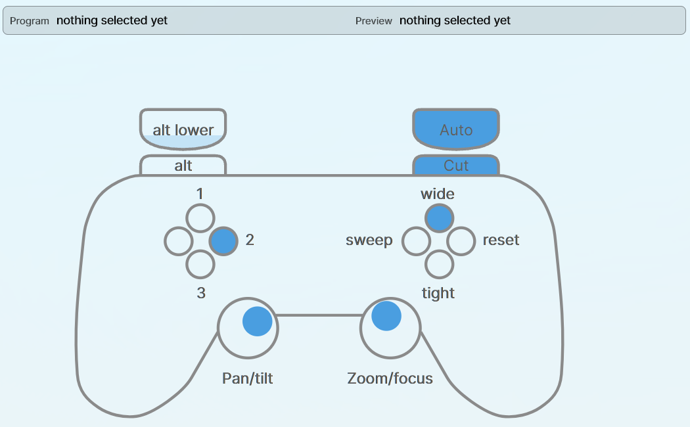

# Interfaces

Entries in `interfaces`. One interface is one set of hands: a mixer it drives, the cameras behind
that mixer's inputs, and the controls that reach them.

There are two kinds and they carry separate schemas. A `keys` block on a `gamepad`, or a `deadzone`
on a `keyboard`, is a binding that will never fire, so it is an error rather than something quietly
dropped. A desk that wants a pad and a mouse configures one of each against the same `videoMixer`.

## What both kinds carry

| Key | Default | Means |
| --- | --- | --- |
| `videoMixer` | required | the `instance` of the mixer this drives |
| `cameraMap` | required | mixer input to camera `instance` |
| `connectionChange` | required | how a direction moves the preview selection |
| `functions` | `{}` | named things a binding can run |
| `enableChangingProgram` | `true` | whether this interface may put anything to air |

`enableChangingProgram` set to `false` turns off cut, auto, and the program row on the keyboard
panel. It is the switch for a desk that frames shots while somebody else cuts.

## `gamepad`

```json
{
  "type": "gamepad",
  "instance": 1,
  "videoMixer": 1,
  "serialNumber": "83234F94",
  "deadzone": 0.05,
  "rumble": true,
  "cameraMap": { "1": 1, "2": 2 },
  "connectionChange": { "type": "direct", "default": { "up": 1, "right": 2 } },
  "functions": { "wide": { "type": "key", "index": 1 } },
  "pad": { "default": { "down": "wide" } }
}
```

| Key | Default | Means |
| --- | --- | --- |
| `serialNumber` | absent | claim only the pad reporting this serial; absent takes the first free pad |
| `deadzone` | `0.05` | stick travel ignored around centre, so the cameras do not drift |
| `rumble` | `true` | whether the pad is allowed to buzz |
| `pad` | `{}` | which named function each face button runs |

The left stick pans and tilts, the right stick zooms and focuses, the direction pad moves the
preview selection through `connectionChange`, the right shoulder cuts and the right trigger autos.
The left shoulder holds `alt` and the left trigger holds `altLower`.

A pad has four face buttons and no more. The way past four is the modifier sets:

```json
"pad": {
  "default":  { "up": "wide", "down": "tight" },
  "alt":      { "up": "sweep" },
  "altLower": { "up": "reset" }
}
```

A modifier only overrides the default where it has something bound for that button. The window
labels each face with the function it would run right now, so the drawing follows the held modifier.

A pad interface is not driven from the window. The wireframe shows what the pad is doing; it is not
a control to click. Each button carries the name of what pressing it would do right now, and a
direction whose input is on preview or program is tinted in that bus's colour.



## `keyboard`

Every key it answers to is in the file. Nothing is bound that is not named here, and nothing named
here is left off the panel, so the window and the file say the same thing.


The panel is a small mixer: a program row and a preview row of the same inputs, cut and auto between
them, and every configured function to the right. Each button names the key that also fires it, and
lights while that key is held. Below them the mouse takes the sticks' place: a pad for pan and tilt,
and a slider each for zoom and focus. Drag and let go, and each springs back to the middle and stops
the camera.

```json
{
  "type": "keyboard",
  "instance": 2,
  "videoMixer": 1,
  "cameraMap": { "1": 1, "2": 2, "3": 3 },
  "connectionChange": { "type": "direct", "default": { "up": 1, "right": 2 } },
  "functions": {
    "wide":  { "type": "key", "index": 1 },
    "sweep": { "type": "macroLoop", "indexes": [1, 2] }
  },
  "keys": {
    "pan":   { "left": "A", "right": "D" },
    "tilt":  { "up": "W", "down": "S" },
    "zoom":  { "in": "I", "out": "K" },
    "focus": { "far": "L", "near": "J" },
    "connectionChange": { "up": "Up", "down": "Down", "left": "Left", "right": "Right" },
    "input":    { "D1": 1, "D2": 2, "D3": 3 },
    "function": { "F1": "wide", "F2": "sweep" },
    "cut":  "Enter",
    "auto": "Space"
  }
}
```

| Key in `keys` | Means |
| --- | --- |
| `pan`, `tilt`, `zoom`, `focus` | a key per direction; held is full speed, released is stopped |
| `connectionChange` | keys that step the selection, as the direction pad does |
| `input` | a key that selects a mixer input outright, which is the room a pad has not got |
| `function` | a key to the name of a function in `functions` |
| `cut`, `auto` | the transition keys |

Every entry is optional. An axis with one end bound moves one way only; an axis with neither is not
reachable from the keyboard at all, and the pad on screen still is.

`input` is what a pad cannot do. A direction pad offers four directions; a number row offers as many
inputs as there are keys.

Modifiers are a pad thing. A keyboard binds every key it has directly, so there is no second set for
a modifier to pick between.

## Functions

Named once, bound by name. The name is what the window writes on the button and next to the face on
the wireframe, so it is worth naming for what it does rather than for what it is.

```json
"functions": {
  "wide":  { "type": "key", "index": 1 },
  "sweep": { "type": "macroLoop", "indexes": [1, 2, 3] },
  "iso":   { "type": "connectionChange", "index": 4 },
  "lower": {
    "type": "macroToggle",
    "indexOn": 23,
    "indexOff": 24,
    "condition": { "type": "key", "key": 0 }
  }
}
```

| `type` | Does |
| --- | --- |
| `key` | toggle the switcher's upstream key `index` |
| `connectionChange` | select input `index` |
| `macroLoop` | run the next macro in `indexes` each press, wrapping round |
| `macroToggle` | run `indexOn` or `indexOff` depending on `condition` |

A `macroToggle` condition is either `{ "type": "key", "key": n }`, which asks whether upstream key
`n` is set, or `{ "type": "aux_selection", "aux": n, "selection": m }`, which asks whether auxiliary
`n` is showing input `m`.

A binding that names a function which is not in `functions` fails at load and the message lists the
names that are, because caught there it points at a line, and caught at run time it is a button that
silently does nothing in the middle of a service.

## `connectionChange`

How a direction moves the preview selection. Two schemes.

```json
"connectionChange": {
  "type": "direct",
  "default":  { "up": 1, "right": 2, "down": 3, "left": 4 },
  "alt":      { "up": 5, "right": 7 },
  "altLower": { "up": 9 }
}
```

`direct` binds each direction to a fixed input, with a set per modifier. A modifier set that is
absent falls back to `default`.

```json
"connectionChange": {
  "type": "directional",
  "directions": {
    "1": { "right": 2 },
    "2": { "left": 1, "right": 3 },
    "3": { "left": 2 }
  }
}
```

`directional` steps from the current input to a neighbour, which is how a row of cameras is walked
along. A selection with no entry falls back to the lowest numbered one.

## Key names

`keys` uses Avalonia's own key names, matched without regard to case. A name that is not one of them
is reported against the entry that carries it.

| Kind | Names |
| --- | --- |
| Letters | `A` to `Z` |
| Number row | `D0` to `D9` |
| Numeric keypad | `NumPad0` to `NumPad9`, `Add`, `Subtract`, `Multiply`, `Divide`, `Decimal` |
| Function keys | `F1` to `F24` |
| Arrows | `Up`, `Down`, `Left`, `Right` |
| Editing | `Enter`, `Space`, `Tab`, `Back`, `Delete`, `Insert`, `Home`, `End`, `PageUp`, `PageDown`, `Escape` |
| Modifiers as keys | `LeftShift`, `RightShift`, `LeftCtrl`, `RightCtrl`, `LeftAlt`, `RightAlt` |
| Punctuation | `OemComma`, `OemPeriod`, `OemMinus`, `OemPlus`, `OemQuestion`, `OemSemicolon`, `OemQuotes`, `OemOpenBrackets`, `OemCloseBrackets`, `OemPipe`, `OemTilde` |

`Enter` and `Return` are the same key; the panel writes it `Return`.
